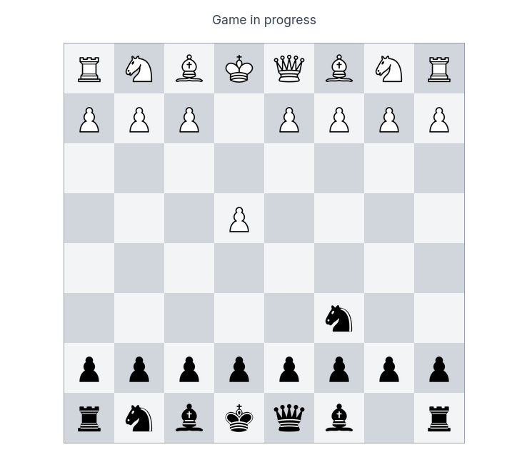

# ♟️ Anonymous Chess

**Anonymous Chess** is a real-time multiplayer chess web application built using WebSockets. Two players are automatically matched through a matchmaking system and can play chess using simple click-based interactions. A chat system is currently under development to enhance player communication.

---

## 🚀 Features

* 🔄 Real-time multiplayer gameplay using WebSockets
* 🤝 Automatic matchmaking system
* ♟️ Click-based chess piece movement
* 🧠 Fully interactive chess logic powered by `chess.js`
* 🌐 Smooth real-time synchronization between players
* 💬 In-game chat system *(in progress)*
* ⚡ Lightweight and fast frontend experience

---

## 🧩 Tech Stack

**Frontend:**

* React.js
* chess.js
* Socket.IO Client

**Backend:**

* Node.js
* Express.js
* Socket.IO

---

Got it — you just need the **Demo section fixed properly** for a local screenshot inside your repo.

Here’s the correct version:

---

## 📸 Demo

### 🖼️ Screenshot




---

## ⚙️ Installation

### 1. Clone the repository

```bash
git clone https://github.com/mhanzlah/anychess.git
cd anychess
```

### 2. Install dependencies

#### Backend

```bash
cd server
npm install
```

#### Frontend

```bash
cd client
npm install
```

---

## ▶️ Running the Project

### Start Backend Server

```bash
cd server
npm start
```

### Start Frontend

```bash
cd client
npm run dev
```

---

## 🧠 How It Works

1. Players join the lobby anonymously
2. Server matches two available players
3. A new chess session is created via WebSockets
4. Moves are validated and synced in real time
5. Game continues until checkmate, resignation, or draw

---

## 💬 Chat System

The chat feature is currently under development and will allow players to:

* Send real-time messages during gameplay
* Communicate anonymously
* Possibly support emojis and quick messages

---

## 📌 Roadmap

* [x] Basic multiplayer gameplay
* [x] Matchmaking system
* [x] Real-time move synchronization
* [x] Spectator mode
* [ ] Chat system
* [ ] Ranking / ELO system
* [ ] Reconnect system
* [ ] Game history storage

---

## 🤝 Contributing

Contributions are welcome! Feel free to fork the repo and submit a pull request.

---

## 📄 License

This project is open source and available under the MIT License.

---

## 👨‍💻 Author

Built with ❤️ by **Hanzla**

